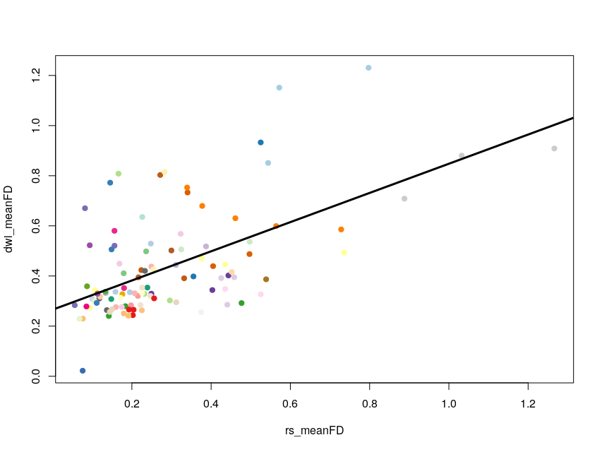
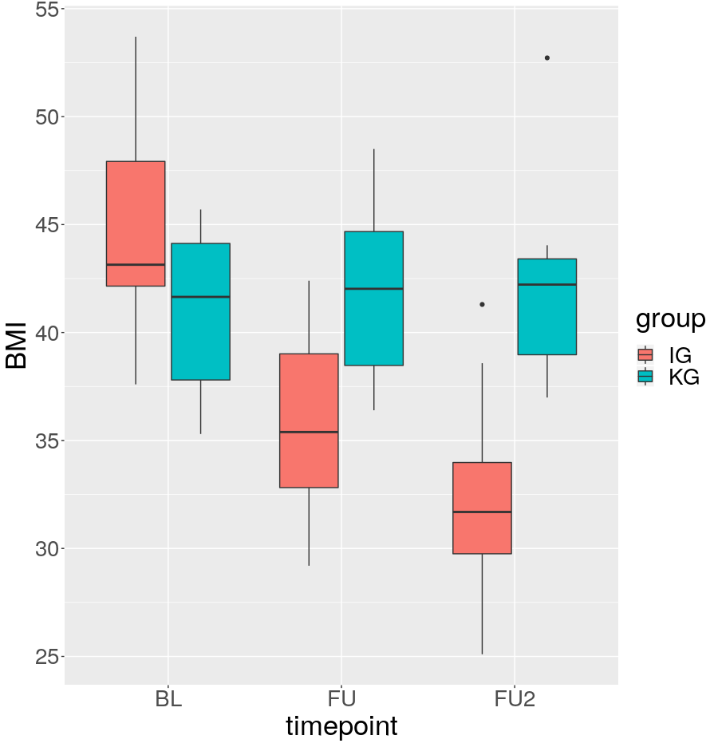

# TBSS

### This repository contains ...

* logfiles/
* script folders for randomise: randomise*/
* orginal scripts from Franz Liem: tbss_long_liem.sh + halfreg.sh
* adapted with proper paths: tbss_long.sh
* adapted to rerun with ADI020 after correction of volumes: tbss_long_rerunADI020.sh
* script to create + subjects list with subjects that have existing BL and FU data: create_subject_list.sh + subjects_bl_fu.txt
* script to copy fa maps into working directory copy_fa_maps_bl_fu.sh
* script to extract necessary subjects values for randomise: extract_Subject_info.R + subjects+group_for_randomise.txt
* script to correct skull voxels in FA maps and skeletons: skull_removal_mean_FA_mask+skeleton.sh
* script to create 4D volumes for both timepoints and both groups separately: split_IG_KG_bl_fu.sh

### Subjects for analysis

* Creation of subjects_bl_fu.txt from folder with finished preprocessing from here: preprocessed/diffusion/dti/ **BUT** only subjects with existing BL and FU data.

* script used: Analysis/Project3_Hyp_DTI/TBSS/create_subject_list.sh

### **Processing History**

#### adaption of ./tbss_long.sh

* all fa maps copied to:wd/tbss/fa

* halfway registration results go to:wd/tbss/halfway

* base FA (of bl, fu and the midpoint between them) go to: wd/tbss/base

#### 04-12-19

* run of TBSS with ADI020 $\rightarrow$ results in wd/tbss/base

#### 06-12-19

* there was an error with ADI020 because of different number of slices in baseline and followup (58 vs 61). Solved by cropping upper three slices in FU.

* QA: wd/tbss/base/FA/slicesdir/index.html checked; tbss preprocessing worked fine

* TBSS results of run on 04-12-19 without ADI020 copied to wd/tbss/base_without_ADI020

* rerun of TBSS with ADI020 $\rightarrow$ results in wd/tbss/base

#### 09-12-19

* QA: skull visible in mean_FA_skeleton $\rightarrow$ eroding of wd/tbss/base/stats/mean_FA_mask.nii.gz twice with kernel box of (3mm)^3 $\rightarrow$ mean_FA_mask_eroded_twice.nii.gz (Analysis/Project3_Hyp_DTI/TBSS/skull_removal_mean_FA_mask+skeleton.sh)

$\Rightarrow$ need to implement eroding in preprocessing pipeline to apply on all subjects

* masking of mean_FA_skeleton_mask.nii.gz $\rightarrow$ mean_FA_skeleton_mask_eroded.nii.gz (Analysis/Project3_Hyp_DTI/TBSS/skull_removal_mean_FA_mask+skeleton.sh)

#### **Prep of randomise**

* calculation of FA differences: all_fu_skeletonised.nii.gz - all_bl_skeletonised.nii.gz

* masking with mean_FA_mask_eroded_twice.nii.gz to remove skull voxels $\rightarrow$ all_fu-bl_skeletonised_eroded.nii.gz
    
$\Rightarrow$ used as input for randomise

* subject-IDs, group, motion values extracted with Analysis/Project3_Hyp_DTI/TBSS/extract_Subject_info.R $\rightarrow$ Analysis/Project3_Hyp_DTI/TBSS/subjects+group_for_randomise.txt

* **NOTE:** motion values taken from resting state due to correlation with T1 quality

* *exploratory stats:* (see Analysis/Project3_Hyp_DTI/TBSS/extract_Subject_info.R )
    * ttestBF(log_mean_meanFD ~ group) = 0.36 ±0%
    * ttestBF(diff_meanFD ~ group) = 2.73 ±0%

#### 10-12-19
#### **running of randomise**

two samples ttest with these options: **-n 1000 --T2 -x --uncorrp**

design matrices and contrasts can be found in following folders for each randomise run

* $\Delta$FA(FU-BL) $\times$ group 
    * scripts: Analysis/Project3_Hyp_DTI/TBSS/randomise_diff_over_time_fu-bl_x_group
    * results: wd/tbss/base/stats/diff_over_time_fu-bl_x_group/
    * $\Rightarrow$ n.s.
        
* $\Delta$FA(FU-BL) $\times$ group corrected for mean motion of two timepoints (log-transformed due to skewness) 
    * scripts: Analysis/Project3_Hyp_DTI/TBSS/randomise_diff_over_time_fu-bl_x_group_motioncorr/log_mean_meanFD
    * results: wd/tbss/base/stats/diff_over_time_fu-bl_x_group_motioncorr/log_mean_meanFD
    * $\Rightarrow$ n.s.
        
* $\Delta$FA(FU-BL) $\times$ group corrected for difference in mean motion between two timepoints 
    * scripts: Analysis/Project3_Hyp_DTI/TBSS/randomise_diff_over_time_fu-bl_x_group_motioncorr/diff_meanFD
    * results: wd/tbss/base/stats/diff_over_time_fu-bl_x_group_motioncorr/diff_meanFD
    * $\Rightarrow$ fu>bl, uncorrected p < .05: sign. JHU-ICBM tracts: cerebellum, Middle cerebellar peduncle, right Superior cerebellar peduncle, left Inferior cerebellar peduncle, posterior Splenium of corpus callosum,  right Posterior corona radiata, right Superior corona radiata, left Superior corona radiata, right Superior longitudinal fasciculus
    
#### **re-running of randomise with motion correction with -n 5000**
* moving of former randomise results into folder: wd/tbss/base/stats/randomise_n_1000

#### **Prep of randomise for post-hoc tests for main effects separately in IG and KG **

* splitting of all_fu_skeletonised.nii.gz and all_bl_skeletonised.nii.gz and creation of seperate volumes: for both timepoints and both groups using Analysis/Project3_Hyp_DTI/TBSS/split_IG_KG_bl_fu.sh
* calculation of FA differences: all_fu_IG_skeletonised.nii.gz - all_bl_IG_skeletonised.nii.gz
* calculation of FA differences: all_fu_KG_skeletonised.nii.gz - all_bl_KG_skeletonised.nii.gz

* masking with mean_FA_mask_eroded_twice.nii.gz to remove skull voxels $\rightarrow$ all_fu-bl_IG_skeletonised_eroded.nii.gz and all_fu-bl_KG_skeletonised_eroded.nii.gz
    
$\Rightarrow$ used as input for randomise

#### **running of randomise for post-hoc tests ** 
one sample ttest with these options: **-n 5000 --T2 -x --uncorrp**

design matrices and contrasts can be found in following folders for each randomise run

* $\Delta$FA(FU-BL) in IG
    * scripts: Analysis/Project3_Hyp_DTI/TBSS/randomise_diff_over_time_fu-bl_IG_motioncorr/
    * results: wd/tbss/base/stats/diff_over_time_fu-bl_IG_motioncorr/
    * $\Rightarrow$ FA seems not to change (uncorr p <0.001)
        
* $\Delta$FA(FU-BL) in KG
    * scripts: Analysis/Project3_Hyp_DTI/TBSS/randomise_diff_over_time_fu-bl_KG_motioncorr/
    * results: wd/tbss/base/stats/diff_over_time_fu-bl_KG_motioncorr/
    * $\Rightarrow$ FA seems to decline (uncorr p <0.001)
        
#### 11-12-19

* *in addition* baseline age (z-scored) extracted with Analysis/Project3_Hyp_DTI/TBSS/extract_Subject_info.R $\rightarrow$ Analysis/Project3_Hyp_DTI/TBSS/subjects+group_for_randomise.txt

#### **running of randomise**

two samples ttest with these options: **-n 5000 --T2 -x --uncorrp**

* $\Delta$FA(FU-BL) $\times$ group, corrected for difference in mean motion between two timepoints 
    * scripts: Analysis/Project3_Hyp_DTI/TBSS/randomise_diff_over_time_fu-bl_x_group_motioncorr_agecorr/diff_meanFD
    * results: wd/tbss/base/stats/diff_over_time_fu-bl_x_group_motioncorr_agecorr/diff_meanFD
    * $\Rightarrow$ fu>bl, uncorrected p < .05: sign. JHU-ICBM tracts: cerebellum, Middle cerebellar peduncle, right Superior cerebellar peduncle, left Inferior cerebellar peduncle, posterior Splenium of corpus callosum,  right Posterior corona radiata, right Superior corona radiata, left Superior corona radiata, right Superior longitudinal fasciculus

#### 17-12-19

#### **running of randomise for post-hoc tests with correction for age ** 
one sample ttest with these options: **-n 5000 --T2 -x --uncorrp**

design matrices and contrasts can be found in following folders for each randomise run

* $\Delta$FA(FU-BL) in IG
    * scripts: Analysis/Project3_Hyp_DTI/TBSS/randomise_diff_over_time_fu-bl_IG_motioncorr_agecorr/
    * results: wd/tbss/base/stats/diff_over_time_fu-bl_IG_motioncorr_agecorr/
    * $\Rightarrow$
        
* $\Delta$FA(FU-BL) in KG
    * scripts: Analysis/Project3_Hyp_DTI/TBSS/randomise_diff_over_time_fu-bl_KG_motioncorr_agecorr/
    * results: wd/tbss/base/stats/diff_over_time_fu-bl_KG_motioncorr_agecorr/
    * $\Rightarrow$
    
#### 18-12-19
    
#### **multiple comparison correction** 

* with FSL fdr; options: --oneminusp -q 0.05
* thresholded images can be found here:
    * wd/tbss/base/stats/diff_over_time_fu-bl_x_group_motioncorr_agecorr/diff_meanFD/fdr_thresh_
    * wd/tbss/base/stats/diff_over_time_fu-bl_IG_motioncorr_agecorr/fdr_thresh_
    * wd/tbss/base/stats/diff_over_time_fu-bl_KG_motioncorr_agecorr/fdr_thresh_
* fdr adjusted p-value images can be found here:
    * wd/tbss/base/stats/diff_over_time_fu-bl_x_group_motioncorr_agecorr/diff_meanFD/fdr_adj_
    * wd/tbss/base/stats/diff_over_time_fu-bl_IG_motioncorr_agecorr/fdr_adj_
    * wd/tbss/base/stats/diff_over_time_fu-bl_KG_motioncorr_agecorr/fdr_adj_
* $\Rightarrow$ nothing significant is leftover

#### 19-12-19

* inflation of significant tracts for interaction and post-hoc tests with tbss_fill: $tbss_fill xyz_tfce_corrp_tstat1.nii.gz {thresh} mean_FA_mask_eroded_twice.nii.gz tbss_fill_{thresh}_tfce_corrp_tstat1.nii.gz$ 
$\Rightarrow$ used for OHBM abstract

#### 06-01-20

* check single subject difference maps all_fu-bl_skeletonised_eroded and mask with $> +/- 0.05$ 
$\Rightarrow$ similar amount of voxels that have 0.05 higher and lower FA from BL to FU 

#### 07-01-20

* calculate motion values from DWI (eddy) even though much longer than in rs-fMRI
* python script to calculate framewise displacement from translation and rotation values calculated by eddy: Analysis/Project3_Hyp_DTI/TBSS/calculate_motion_params_DTI.py
* single subject values: wd/motion_FD_DWI/
* all subjects and timepoints: wd/motion_FD_DWI/FD_all_subjects.csv
* **BUT** ADI006_bl: missing eddy_parameters

$\rightarrow$ correlation with rs-motion: $lmBF > 1.5*10^8$ (R-Script: Analysis/Project3_Hyp_DTI/TBSS/correlation_framewise_displacement.R)

#### 07-01-20
* BMI_BL and BMI_change as covariate in randomise
* $\Delta$FA(FU-BL) $\times$ group, corrected for difference in mean motion between two timepoints, age corrected and corrected for BL BMI and BMI change 
    * scripts: Analysis/Project3_Hyp_DTI/TBSS/randomise_diff_over_time_fu-bl_x_group_motioncorr_agecorr_BMI/diff_meanFD
    * results: wd/tbss/base/stats/diff_over_time_fu-bl_x_group_motioncorr_agecorr_BMI/diff_meanFD
* $\Rightarrow$ nothing significant leftover after fdr correction

#### 07-01-20
#### including FU2
**TBSS with halway registration**

* halfway registration results go to:wd/tbss/halfway_bl_fu2
* base FA (of bl, fu2 and the midpoint between them) go to: wd/tbss/base_bl_fu2
* error with ADI020 because of different number of slices in baseline and followup2 (58 vs 61). Solved by cropping upper three slices in FU2.
* running of tbss_long. results in wd/tbss/base_bl_fu2
* QA: wd/tbss/base_bl_fu2/FA/slicesdir/index.html looks fine except for skull
* $\Rightarrow$ masking of mean_FA_skeleton_mask.nii.gz $\rightarrow$ mean_FA_skeleton_mask_eroded.nii.gz (Analysis/Project3_Hyp_DTI/TBSS/skull_removal_mean_FA_mask+skeleton.sh)

#### 09-01-20

**Prep of randomise**

* splitting of 4D dataset mean_FA_skeleton_mask_eroded.nii.gz into IG and KG
* calculation of FA differences: all_fu2_skeletonised.nii.gz - all_bl_skeletonised.nii.gz
* masking with mean_FA_mask_eroded_twice.nii.gz to remove skull voxels $\rightarrow$ all_fu2-bl_skeletonised_eroded.nii.gz
* $\Rightarrow$ used as input for randomise
* subject-IDs, group, motion values extracted with Analysis/Project3_Hyp_DTI/TBSS/extract_Subject_info.R $\rightarrow$ Analysis/Project3_Hyp_DTI/TBSS/subjects+group_for_randomise.txt

**running of randomise**

two samples ttest with these options: **-n 5000 --T2 -x --uncorrp**

* $\Delta$FA(FU2-BL) $\times$ group, corrected for difference in mean motion between two timepoints, corrected for age and corrected for BMI_BL and BMI_change 
    * scripts: Analysis/Project3_Hyp_DTI/TBSS/randomise_diff_over_time_fu2-bl_x_group_motioncorr_agecorr/diff_meanFD
    * results: wd/tbss/base_bl_fu2/stats/diff_over_time_fu2-bl_x_group_motioncorr_agecorr/diff_meanFD
    * $\Rightarrow$ results: after FDR correction several significant tracts (Probability Threshold is 0.0232) showing reduction predicted by group but not motion, age, baseline BMI or BMI change

#### 27-01-20

**running of randomise**

one sample ttest with these options: **-n 5000 --T2 -x --uncorrp**

* $\Delta$FA(FU2-BL) post-hoc for IG and KG, corrected for difference in mean motion between two timepoints, corrected for age and corrected for BMI_BL and BMI_change 
    * scripts: Analysis/Project3_Hyp_DTI/TBSS/randomise_diff_over_time_fu2-bl_IG_motioncorr_agecorr_BMI and Analysis/Project3_Hyp_DTI/TBSS/randomise_diff_over_time_fu2-bl_KG_motioncorr_agecorr_BMI 
    * results: wd/tbss/base_bl_fu2/stats/diff_over_time_fu2-bl_IG_motioncorr_agecorr_BMI and wd/tbss/base_bl_fu2/stats/diff_over_time_fu2-bl_KG_motioncorr_agecorr_BMI 
    * $\Rightarrow$ results: after FDR correction: no significant increase or reduction in FA neither for intervention nor for control group. No significant increase or decrease predicted by motion, age, baseline BMI or BMI change.

##### 31-01-2020 

#### 19-02-2020

* correction of z scoring within IG and KG separately $\Rightarrow$ new tables: /data/pt_02161/Analysis/Project3_Hyp_DTI/TBSS/subjects_..._corrected_Age_z.txt

* correction of interaction TBSS: added EV to design.mat to get results for KG (mistake ) and removed BMI influences because of high correlation with group

#### **TO DO**
* extract mean FA values for whole brain and ROIs
* fit lm to mean BL, FU and FU2 FA values
* calculate TBSS with MD maps
* PSMD scores
* correlate with cogn measures (TMT)
* diabetic status (Michaud)
* linear mixed models / toolbox (Michaud)
* hypothalmus MD
* fibre tracking?
* upload to neurovault